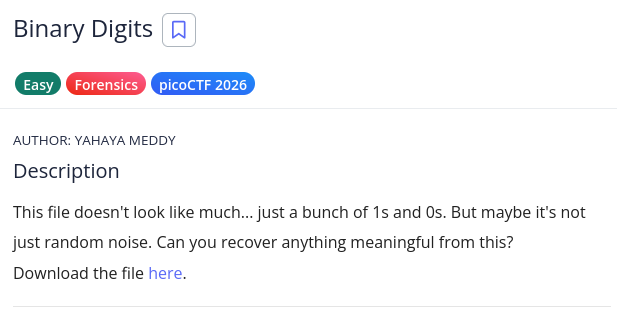

# picoCTF Writeup - Binary Digits

## Mục tiêu
Dưới đây là mô tả chi tiết từ đề bài:

Đề bài cung cấp một tệp tin digits.bin chứa một chuỗi dài các ký tự nhị phân (0 và 1). Nhiệm vụ của chúng ta là giải mã chuỗi này để khôi phục lại tệp tin gốc và tìm ra Flag ẩn giấu bên trong.

## Phân tích
Dựa trên các dữ kiện thu thập được:
- **Dấu hiệu:** CKhi mở file digits.bin, ta thấy nội dung chỉ bao gồm các ký tự 0 và 1. Đây là biểu diễn dưới dạng văn bản (string) của dữ liệu nhị phân thô.

- **Lỗ hổng:** 
    - 8 ký tự nhị phân sẽ tương ứng với 1 byte dữ liệu.
    - Sau khi chuyển đổi thử các byte đầu tiên (11111111 11011000), ta thu được mã Hex là FF D8. Đây là Magic Bytes đặc trưng của định dạng tệp tin JPEG.

- **Ý tưởng:** KCần viết một script Python để đọc chuỗi văn bản nhị phân này, chuyển đổi nó về dạng mảng byte (byte array) và lưu thành một file ảnh hoàn chỉnh.

## Khai thác

Các bước thực hiện chi tiét:
1. **Đọc dữ liệu:**
Sử dụng hàm open().read() để lấy toàn bộ chuỗi số từ digits.bin.

2. **Chuyển đổi hệ cơ số:**
Sử dụng hàm int(s, 2) để chuyển chuỗi nhị phân sang số nguyên lớn.
 
3. **Đóng gói byte:** 
Chuyển số nguyên đó thành các byte dữ liệu thô với độ dài tương ứng (len(s) // 8).

4. **Xuất file:**
Ghi dữ liệu vào file out.bin (hoặc out.jpg) để kiểm tra kết quả.

Flag:

