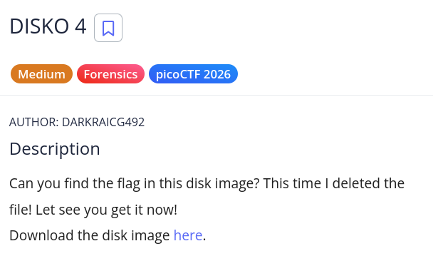
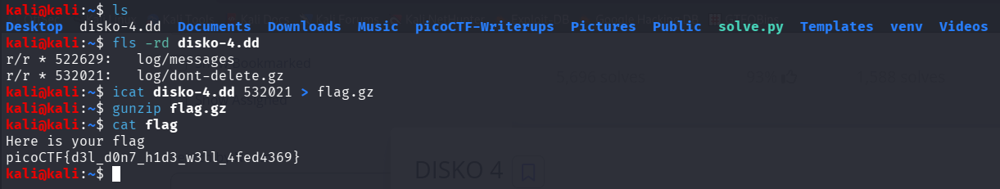

# picoCTF Writeup - DISKO 4

## Mục tiêu
Dưới đây là mô tả chi tiết từ đề bài:



Bài toán yêu cầu tìm flag trong một disk image. Lần này tác giả đã xóa file chứa flag. Nhiệm vụ của chúng ta là sử dụng các công cụ forensics để khôi phục file đã bị xóa từ disk image.

## Phân tích
Dựa trên các dữ kiện thu thập được:
- **Dấu hiệu:** Tên thử thách "DISKO 4" cùng tag "Forensics" gợi ý rõ ràng về việc cần phải phân tích một disk image. Bài toán nhấn mạnh "This time I deleted the file" - có nghĩa file flag đã bị xóa nhưng vẫn có thể khôi phục được từ disk.

- **Lỗ hổng:** Khi một file bị xóa từ file system, dữ liệu vật lý của nó vẫn còn trên disk. Sử dụng công cụ `icat` từ bộ công cụ The Sleuth Kit, ta có thể truy cập trực tiếp vào inode cụ thể và đọc dữ liệu đã bị xóa. File log chứa thông tin về các file đã bị xóa, bao gồm cả inode của chúng.

- **Ý tưởng:** Sử dụng `fsstat` hoặc `ils` để liệt kê các inode từ disk image, sau đó dùng `icat` để đọc dữ liệu từ các inode cụ thể. File flag có thể nằm trong các log file hoặc có thể khôi phục từ inode riêng lẻ.

## Khai thác

Các bước thực hiện chi tiết:
1. **Liệt kê các file trong disk image đã bị xóa:**
Sử dụng lệnh sau để xem danh sách các file đã bị xóa:
```bash
fls -rd disko-4.dd
```
Sau khi chạy xong ta nhận được output như sau:
```bash
r/r * 522629:   log/messages
r/r * 532021:   log/dont-delete.gz
```

2. **Khôi phục dữ liệu từ inode:**
Sử dụng icat để đọc dữ liệu từ inode cụ thể:
```bash
icat disko-4.dd 532021 > flag.gz
```

3. **Giải nén file:**
File flag được nén với gzip, cần giải nén để lấy dữ liệu:
```bash
gunzip flag.gz
```

4. **Đọc flag:**
Sử dụng cat để xem nội dung flag:
```bash
cat flag
```
Flag: picoCTF{d3l_d0n7_h1d3_w3ll_4fed4369}

Các bước được mô tả bằng hình ảnh chi tiết:

