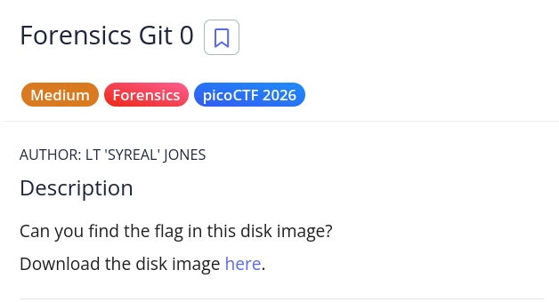
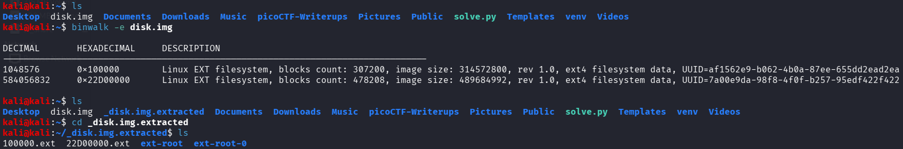
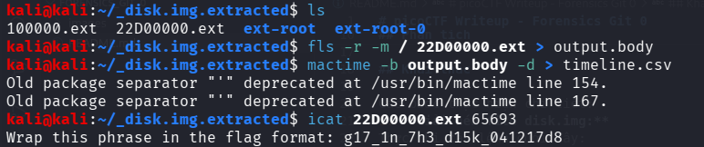

# picoCTF Writeup - Forensics Git 0

## Mục tiêu
Dưới đây là mô tả chi tiết từ đề bài:



Bài toán cung cấp một file disk image và yêu cầu người chơi thực hiện các kỹ năng điều tra số (Forensics) để tìm kiếm cờ được ẩn giấu bên trong phân vùng ổ đĩa. Sau khi tìm được chuỗi bí mật, cần bọc lại bằng định dạng chuẩn của picoCTF.

## Phân tích
Dựa trên các dữ kiện thu thập được:
- **Dấu hiệu:** Cên thử thách "Forensics Git 0" cùng tag "Forensics" gợi ý rõ ràng về việc cần phải trích xuất và phân tích dòng thời gian (timeline) cùng với file có liên quan đến Git. Dữ liệu làm việc thực tế trên terminal là một file disk image chứa nhiều phân vùng có lên là disk.img.

- **Lỗ hổng:** Khi dùng lệnh file disk.img ta nhận thấy rằng đây là một file image chứa nhiều phân vùng, điều này đã hướng tôi đến việc sử dụng binwalk tool.

- **Ý tưởng:** Sử dụng binwalk tool để extract file disk image. Sau đó sử dụng các tool của bộ TSK để tìm ra flag.

## Khai thác

Các bước thực hiện chi tiét:
1. **Giải nén file disk.img:**
Thực thi câu lệnh dưới đây:
```bash
binwalk -e disk.img
```

2. **Tạo timeline và nhận cờ:**
Sau khi extract file disk.img ta nhận được file 22D00000.ext, đây là một phân vùng của file disk.img. Ta sẽ tạo timeline từ fine này. Thực thi các câu lệnh dưới đây:
```bash
fls -r -m / 22D00000.ext > output.body

mactime -b output.body -d > timeline.csv
```
Sau khi xử lý file timeline.csv ta phát hiện một file đáng ngờ tại inode 65693
Sử dụng câu lệnh icat để xem nội dung tại inode này:
```bash
icat 22D00000.ext 65693
```
Và đây là nội dung file tại inode 65693:
Wrap this phrase in the flag format: g17_1n_7h3_d15k_041217d8
Vậy flag: picoCTF{g17_1n_7h3_d15k_041217d8}

Các bước mô tả chi tiết bằn hình ảnh:






