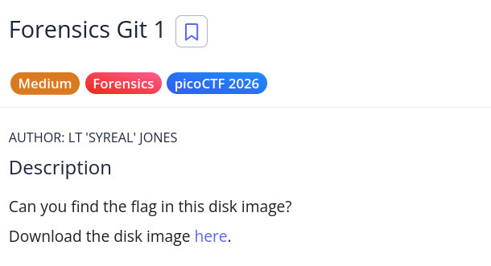
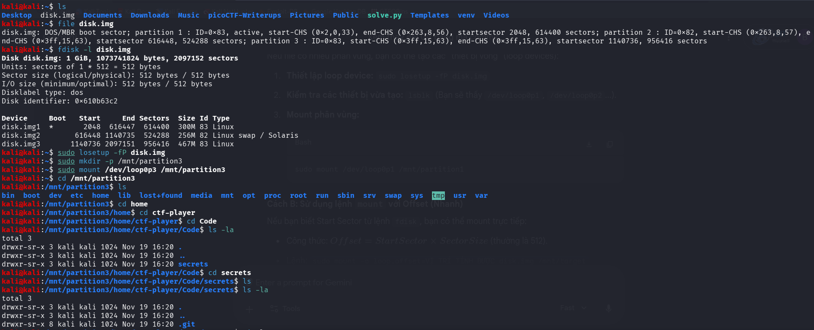
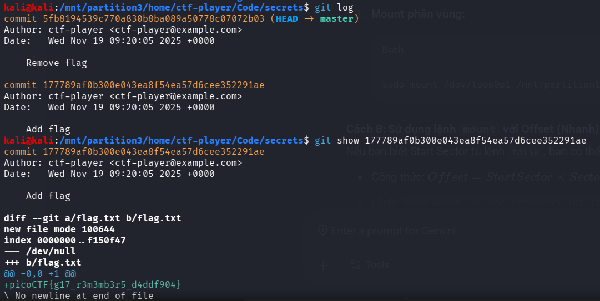

# picoCTF Writeup - Forensics Git 1

## Mục tiêu
Dưới đây là mô tả chi tiết từ đề bài:



Can you find the flag in this disk image? Đây là bài toán yêu cầu người chơi phân tích một disk image để tìm flag được ẩn giấu. Bạn cần tải xuống disk image và thực hiện các kỹ năng điều tra số để khám phá cờ.

## Phân tích
Dựa trên các dữ kiện thu thập được:
- **Dấu hiệu:** Tên thử thách "Forensics Git 1" cùng tag "Forensics" gợi ý rõ ràng về việc cần phải phân tích một disk image chứa các phân vùng Linux. Khám phá file system sẽ dẫn tới việc tìm kiếm git repository có liên quan.

- **Lỗ hổng:** Khi khám phá disk image, ta nhận thấy có một git repository trong thư mục `/home/ctf-player/Code/secrets`. Git lưu trữ toàn bộ lịch sử commit, bao gồm cả các file đã bị xóa. Bằng cách kiểm tra lịch sử git, ta có thể tìm thấy flag trong một commit trước đó mà sau đó đã bị xóa (commit "Remove flag").

- **Ý tưởng:** Sử dụng lệnh `mount` để gắn các phân vùng từ disk image, tìm kiếm git repository, sau đó dùng `git log` và `git show` để xem lịch sử commit và tìm flag trong commit "Add flag".

## Khai thác

Các bước thực hiện chi tiết:
1. **Phân tích và gắn disk image:**
Sử dụng các lệnh sau để phân tích disk image:
```bash
file disk.img
fdisk -l disk.img
```
Tiếp theo, tạo các thư mục mount và gắn các phân vùng:
```bash
sudo losetup -fP disk.img
sudo mkdir -p /mnt/partition3
sudo mount /dev/loop0p3 /mnt/partition3
```

2. **Khám phá file system và tìm git repository:**
Duyệt qua file system để tìm git repository:
```bash
cd /mnt/partition3/home/ctf-player/Code/secrets
ls -la
```
Ta sẽ phát hiện thư mục .git chứa lịch sử commit.

3. **Sử dụng git log để xem lịch sử:**
Sử dụng git log để xem các commit:
```bash
git log
```
Tại đây ta sẽ thấy hai commit:
- Commit với message "Remove flag"
- Commit với message "Add flag" (commit trước đó)

4. **Xem nội dung commit "Add flag":**
Sử dụng git show để xem diff của commit chứa flag:
```bash
git show <commit_hash>
```
Trong output của lệnh này, ta sẽ thấy file flag.txt được thêm vào với nội dung:
```bash
+picoCTF{g17_r3m3mb3r5_d4ddf904}
```
Vậy flag: picoCTF{g17_r3m3mb3r5_d4ddf904}

Các bước được mô tả bằng hình ảnh chi tiết:




