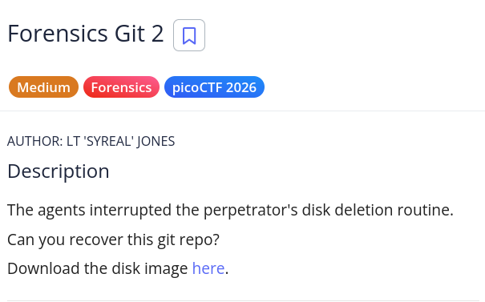
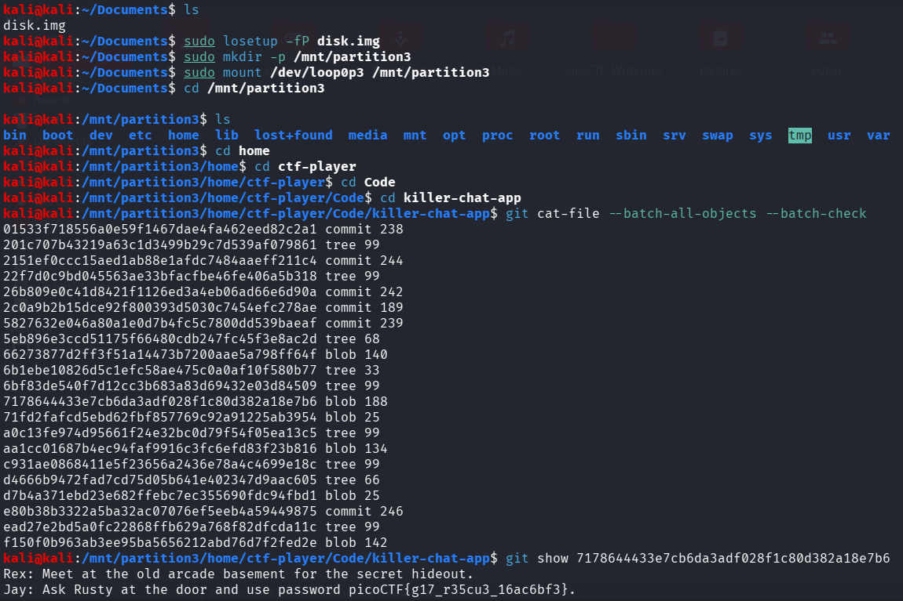

# picoCTF Writeup - Forensics Git 2

## Mục tiêu
Dưới đây là mô tả chi tiết từ đề bài:



Bài toán yêu cầu khôi phục git repository từ một disk image. Các tác nhân đã ngắt quãng thủ tục xóa dữ liệu của thủ phạm, để lại dấu vết git có thể khôi phục được.

## Phân tích
Dựa trên các dữ kiện thu thập được:
- **Dấu hiệu:** Tên thử thách "Forensics Git 2" cùng tag "Forensics" gợi ý rõ ràng về việc cần phải phân tích một disk image chứa các phân vùng Linux. Git lưu trữ toàn bộ lịch sử commit, bao gồm cả các file và dữ liệu đã bị xóa hoặc chưa được commit.

- **Lỗ hổng:** Khi khám phá disk image, ta nhận thấy có một git repository trong thư mục `/home/ctf-player/Code/killer-chat-app`. Bằng cách sử dụng các lệnh git mạnh mẽ như `git cat-file` và `git show`, ta có thể truy cập vào các object trong git database để tìm ra dữ liệu ẩn giấu hoặc đã bị xóa.

- **Ý tưởng:** Sử dụng lệnh `mount` để gắn các phân vùng từ disk image, tìm kiếm git repository, sau đó dùng `git cat-file` để liệt kê các git objects và dùng `git show` để xem nội dung của các commit, từ đó khám phá flag.

## Khai thác

Các bước thực hiện chi tiết:
1. **Phân tích và gắn disk image:**
Sử dụng các lệnh sau để phân tích disk image:
```bash
file disk.img
fdisk -l disk.img
```
Tiếp theo, gắn disk image và tạo các mount point:
```bash
sudo losetup -fP disk.img
sudo mkdir -p /mnt/partition3
sudo mount /dev/loop0p3 /mnt/partition3
```

2. **Khám phá file system và tìm git repository:**
Duyệt qua file system để tìm git repository:
```bash
cd /mnt/partition3/home/ctf-player/Code/killer-chat-app
ls -la
```
Ta sẽ phát hiện thư mục .git chứa lịch sử commit.

3. **Liệt kê các git objects:**
Sử dụng git cat-file để liệt kê toàn bộ objects trong git repository:
```bash
git cat-file --batch-all-objects --batch-check
```
Điều này sẽ hiển thị danh sách tất cả các objects được lưu trữ trong git database.

4. **Xem nội dung commit:**
Sử dụng git show để xem nội dung chi tiết của một commit cụ thể:
```bash
git show 717864433e7cb6da3adf028f1c80d382a18e7b6
```
Trong output của lệnh này, ta sẽ thấy nội dung của các message hoặc file:
```bash
Rex: Meet at the old arcade basement for the secret hideout.
Jay: Ask Rusty at the door and use password picoCTF{g17_r35cu3_16ac6bf3}.
```
Flag: picoCTF{g17_r35cu3_16ac6bf3}

Các bước được mô tả bằng hình ảnh chi tiết:

