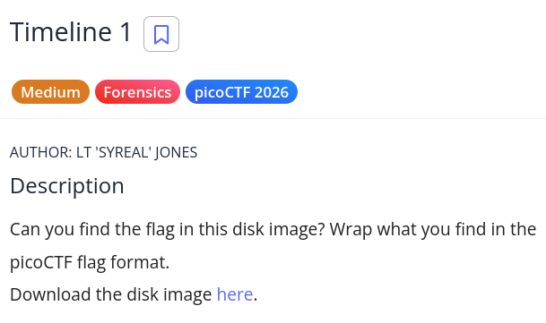
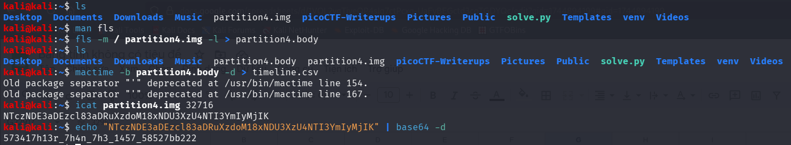

# picoCTF Writeup - Timeline 1

## Mục tiêu
Dưới đây là mô tả chi tiết từ đề bài:



Bài toán cung cấp một file disk image và yêu cầu người chơi thực hiện các kỹ năng điều tra số (Forensics) để tìm kiếm cờ được ẩn giấu bên trong phân vùng ổ đĩa. Sau khi tìm được chuỗi bí mật, cần bọc lại bằng định dạng chuẩn của picoCTF.

## Phân tích
Dựa trên các dữ kiện thu thập được:
- **Dấu hiệu:** Cên thử thách "Timeline 1" cùng tag "Forensics" gợi ý rõ ràng về việc cần phải trích xuất và phân tích dòng thời gian (timeline) sự kiện của hệ thống tập tin. Dữ liệu làm việc thực tế trên terminal là một file image của phân vùng (có tên là partition4.img).

- **Lỗ hổng:** Đây là bài toán kiểm tra kỹ năng sử dụng bộ công cụ điều tra số mã nguồn mở The Sleuth Kit (TSK) trên Linux. Việc tạo timeline từ các mốc thời gian MAC (Modified, Accessed, Changed/Created) của hệ thống tập tin giúp điều tra viên phát hiện ra các tệp tin có dấu hiệu bất thường (bị sửa đổi hoặc tạo mới một cách đáng ngờ). File chứa cờ có nội dung đã được mã hóa bằng Base64.

- **Ý tưởng:** 
    - Sử dụng lệnh fls để quét cấu trúc thư mục/file của disk image và xuất ra một file trung gian chứa metadata (body file).
    - Dùng lệnh mactime để biên dịch body file thành một file dạng .csv có thể đọc được để phân tích dòng thời gian.
    - Qua phân tích (giả định tìm được dấu vết bất thường), xác định được file tình nghi nằm tại inode 32716.
    - Sử dụng lệnh icat để trích xuất trực tiếp nội dung của file từ inode này, sau đó giải mã chuỗi Base64 thu được để lấy flag.

## Khai thác

Các bước thực hiện chi tiét:
1. **Trích xuất thông tin và giải mã:**
Thực thi tuần tự các lệnh trong terminal sử dụng bộ công cụ TSK và các công cụ mặc định của Linux để phân tích disk image partition4.img.
```bash
# Trích xuất dữ liệu metadata của hệ thống file tạo thành file body
kali@kali:~$ fls -r -m / partition4.img > partition4.body

# Tạo file timeline định dạng CSV từ file body để phân tích
kali@kali:~$ mactime -b partition4.body -d > timeline.csv

# Sau khi phân tích timeline và xác định được inode khả nghi là 4945, trích xuất nội dung file
kali@kali:~$ icat partition4.img 32716 > flag

# Xem nội dung file thu được (phát hiện chuỗi bị mã hóa Base64)
kali@kali:~$ cat flag
NTczNDE3aDEzcl83aDRuXzdoM18xNDU3XzU4NTI3YmIyMjIK

# Giải mã chuỗi Base64 để lấy nội dung thực sự
kali@kali:~$ echo "NzFtMzExbjNfMHU3MTEzcl9oM3JfNDNhMmU3YWYK" | base64 -d
573417h13r_7h4n_7h3_1457_58527bb222
```

2. **Thực thi và nhận cờ:**
Chuỗi nhận được sau khi giải mã Base64 là 71m311n3_0u7113r_h3r_43a2e7af. Dựa theo yêu cầu từ phần mô tả ("Wrap what you find in the picoCTF flag format"), ta sẽ bọc chuỗi này vào định dạng picoCTF{...}.

Flag: picoCTF{573417h13r_7h4n_7h3_1457_58527bb222}

Các bước mô tả chi tiết bằn hình ảnh:


