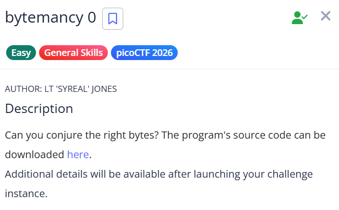
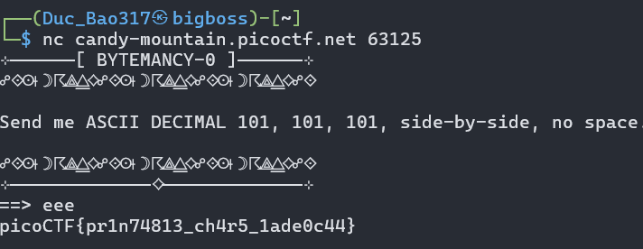

# picoCTF Writeup - bytemancy 0

## Mục tiêu
Dưới đây là mô tả chi tiết từ đề bài:



Giải mã và gửi đúng các ký tự dựa trên giá trị ASCII được yêu cầu tới máy chủ để lấy được nội dung cờ (flag).

## Phân tích
Dựa trên các dữ kiện thu thập được:
- **Dấu hiệu:** Khi kết nối vào dịch vụ, hệ thống đưa ra thông báo yêu cầu người chơi gửi dữ liệu: Send me ASCII DECIMAL 101, 101, 101, side-by-side, no space. (Gửi cho tôi mã ASCII hệ thập phân 101, 101, 101, đặt cạnh nhau, không có khoảng trắng).

- **Lỗ hổng:** Thử thách này thuộc danh mục General Skills nên không chứa lỗ hổng bảo mật phần mềm. Đây chỉ là một bài kiểm tra kiến thức cơ bản về cách tra cứu và chuyển đổi bảng mã ASCII.

- **Ý tưởng:** Tra cứu bảng mã ASCII chuẩn, ta thấy giá trị thập phân (Decimal) 101 tương ứng với ký tự chữ cái e in thường. Vì đề bài yêu cầu gửi 3 giá trị 101 sát nhau và không có khoảng trắng, chuỗi cần nhập chính xác là eee.

## Khai thác
Các bước thực hiện chi tiết:

1. **Kết nối tới dịch vụ:**
Mở terminal và nhập lệnh sau để kết nối tới server bài thi:
```bash
nc candy-mountain.picoctf.net 63125
```
Sau khi server in ra thông báo yêu cầu Send me ASCII DECIMAL 101..., tại dấu nhắc lệnh ==>, nhập vào chuỗi đã giải mã là eee và nhấn Enter.

Server sẽ lập tức xác nhận và in ra flag:
picoCTF{pr1n74813_ch4r5_1ade0c44}

Các bước mình đã thực hiện để lấy flag:


