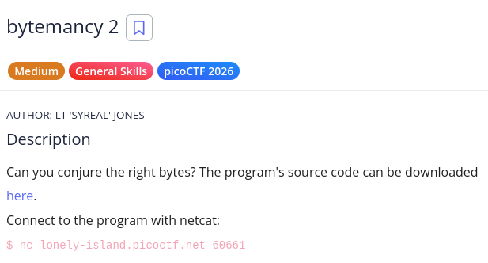
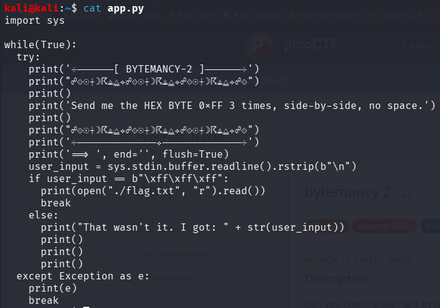
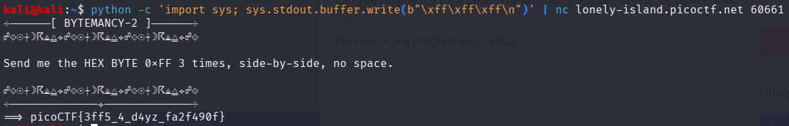

# picoCTF Writeup - bytemancy 2

## Mục tiêu
Dưới đây là mô tả chi tiết từ đề bài:



Gửi chính xác 3 byte hex 0xFF liên tiếp (raw bytes) tới máy chủ thông qua Netcat để lấy được nội dung file flag.

## Phân tích
Dựa trên các dữ kiện thu thập được:
- **Dấu hiệu:** Thông báo từ máy chủ và mã nguồn app.py yêu cầu đầu vào là 3 byte 0xFF liền nhau. Server kiểm tra điều kiện if user_input == b"\xff\xff\xff":. Hàm sys.stdin.buffer.readline() được sử dụng, cho thấy server đọc dữ liệu dưới dạng byte thô (raw bytes) chứ không phải chuỗi ký tự (string) thông thường, sau đó loại bỏ ký tự xuống dòng bằng .rstrip(b"\n").

- **Lỗ hổng:** Đây không hẳn là một lỗ hổng bảo mật mà là bài toán kiểm tra kỹ năng cơ bản (General Skills). Bạn không thể gõ trực tiếp ký tự đại diện cho byte 0xFF thông qua bàn phím thông thường vào terminal của Netcat.

- **Ý tưởng:** Chúng ta cần một công cụ có thể xuất ra các byte thô chính xác. Có thể sử dụng Python với sys.stdout.buffer.write() để tạo ra chuỗi byte b"\xff\xff\xff\n" (bao gồm cả ký tự xuống dòng để báo hiệu kết thúc nhập), sau đó sử dụng toán tử pipe (|) trong Linux để truyền luồng dữ liệu đầu ra này thẳng vào lệnh Netcat.

## Khai thác

Các bước thực hiện chi tiét:
1. **Kết nối tới dịch vụ và gửi payload:**
Chúng ta sẽ chạy một lệnh (one-liner) trên terminal kết hợp Python và Netcat.
```bash
python -c 'import sys; sys.stdout.buffer.write(b"\xff\xff\xff\n")' | nc lonely-island.picoctf.net 60661
```

2. **Kết quả:**
Máy chủ nhận diện thành công chuỗi byte và in ra flag:
Flag: picoCTF{3ff5_4_d4yz_fa2f490f}

Các bước được mô tả bằng hình ảnh chi tiết:




