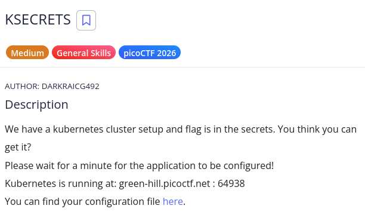
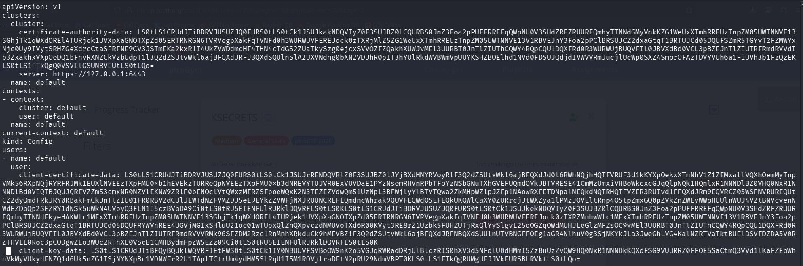
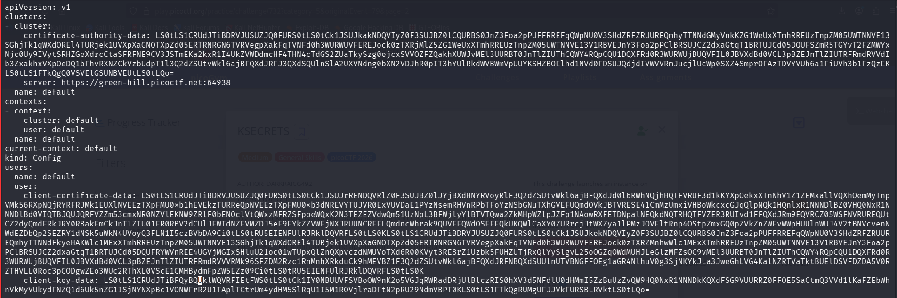
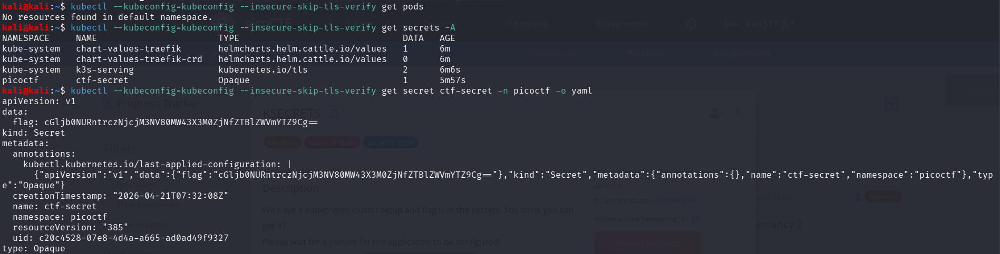

# picoCTF Writeup - KSECRETS

## Mục tiêu
Dưới đây là mô tả chi tiết từ đề bài:



Kết nối vào một Kubernetes cluster được cung cấp sẵn thông qua file cấu hình (kubeconfig) và tìm flag được cất giấu bên trong các Kubernetes Secrets.

## Phân tích
Dựa trên các dữ kiện thu thập được:
- **Dấu hiệu:** Đề bài cung cấp địa chỉ của Kubernetes server là green-hill.picoctf.net:64938 cùng với một file cấu hình có thể tải về. Tuy nhiên, khi kiểm tra file cấu hình ban đầu (như trong ảnh Step1), giá trị server lại đang trỏ về localhost (https://127.0.0.1:6443).

- **Lỗ hổng:** Đây là dạng bài kiểm tra kỹ năng chung (General Skills), không khai thác lỗ hổng phần mềm mà yêu cầu kiến thức tương tác với Kubernetes API thông qua công cụ dòng lệnh kubectl.Đây là dạng bài kiểm tra kỹ năng chung (General Skills), không khai thác lỗ hổng phần mềm mà yêu cầu kiến thức tương tác với Kubernetes API thông qua công cụ dòng lệnh kubectl.

- **Ý tưởng:** Đầu tiên, cần phải chỉnh sửa file cấu hình kubeconfig để trỏ đúng tới địa chỉ server mà đề bài đã cho. Tiếp theo, kết nối đến cluster và dùng lệnh kubectl để liệt kê toàn bộ các secrets trong mọi namespace, từ đó xác định secret chứa flag, xuất nội dung ra và giải mã dữ liệu base64 để lấy được cờ. Lưu ý cần dùng thêm tham số --insecure-skip-tls-verify để bỏ qua lỗi xác thực chứng chỉ SSL/TLS.

## Khai thác

Các bước thực hiện chi tiét:
1. **Cấu hình lại thông tin kết nối:**
Mở file cấu hình vừa tải về và tiến hành sửa đổi giá trị của server để trỏ tới đích.
Từ:
```bash
server: https://127.0.0.1:6443
```
Sửa thành:
```bash
server: https://green-hill.picoctf.net:64938
```

2. **Liệt kê và tìm kiếm Secrets trong Cluster:**
Sử dụng công cụ kubectl kết hợp với file cấu hình đã sửa để kiểm tra danh sách toàn bộ secret trên các namespaces (-A).
```bash
kubectl --kubeconfig=kubeconfig --insecure-skip-tls-verify get secrets -A
```
Dựa vào kết quả trả về , ta có thể thấy một secret khả nghi mang tên ctf-secret nằm trong namespace là picoctf.

3. **Trích xuất nội dung của Secret:** 
Truy vấn trực tiếp vào secret ctf-secret trong namespace picoctf và xuất kết quả ra dưới định dạng YAML để đọc được data bên trong.
```bash
kubectl --kubeconfig=kubeconfig --insecure-skip-tls-verify get secret ctf-secret -n picoctf -o yaml
```
Kết quả trả về trên Terminal chứa thông tin dữ liệu đã được mã hóa:
```bash
apiVersion: v1
data:
  flag: cGljb0NURntKcjM3NV80MW43X3M0ZjNfZTBlZWVmYTZ9Cg==
kind: Secret
# ... (các thông tin metadata khác)
```
4. **Giải mã để lấy Flag:**
Theo mặc định của Kubernetes, dữ liệu trong Secret được mã hóa bằng Base64. Ta tiến hành copy chuỗi dữ liệu này và giải mã trực tiếp trên Cyberchef:
Flag: picoCTF{ks3cr375_41n7_s4f3_e0eeefa6}

Các bước được mô tả bằng hình ảnh chi tiết:






