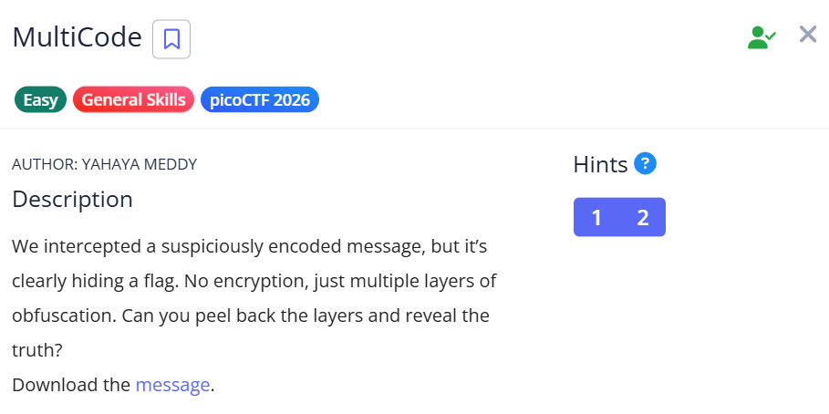
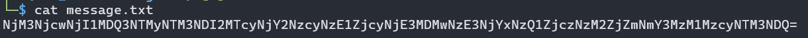
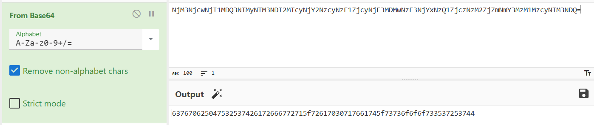
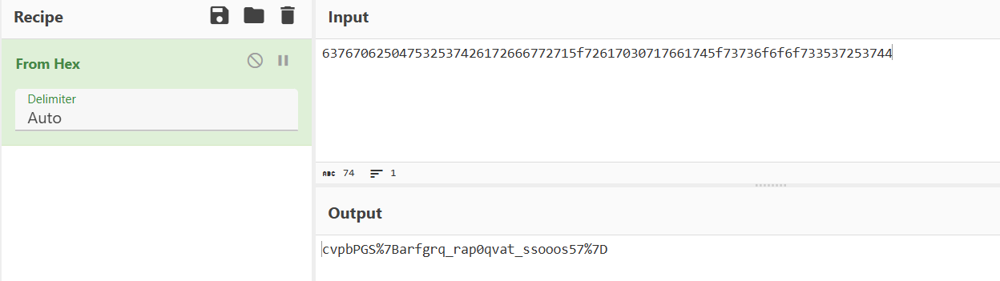
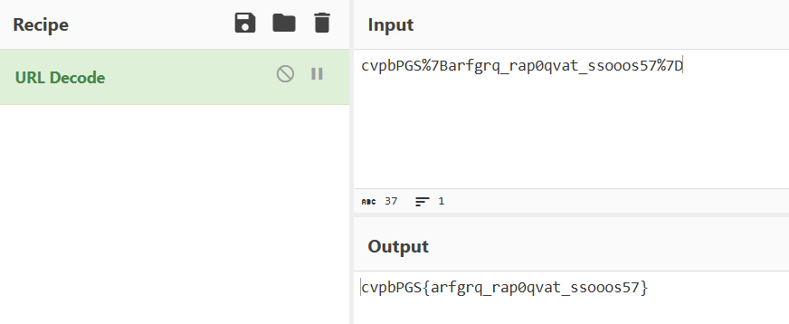
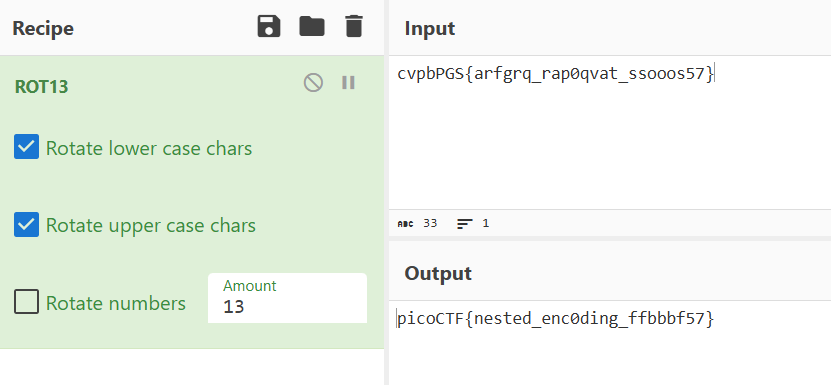

# picoCTF Writeup - MultiCode

## Mục tiêu
Dưới đây là mô tả chi tiết từ đề bài:



Đọc và giải mã một thông điệp bị che giấu qua nhiều lớp mã hóa (multiple layers of obfuscation) từ file message.txt để trích xuất ra flag cuối cùng.

## Phân tích
Dựa trên các dữ kiện thu thập được:
- **Dấu hiệu:**
    - Chuỗi ban đầu có ký tự `=` ở cuối, dấu hiệu điển hình của mã hóa **Base64**.
    - Kết quả sau lớp 1 là một chuỗi số và ký tự (0-9, a-f), dấu hiệu của mã **Hexadecimal**.
    - Kết quả sau lớp 2 chứa các mã như `%7B` và `%7D`, dấu hiệu của **URL Encoding**.
    - Kết quả sau lớp 3 có định dạng `cvpbPGS{...}`, tương đồng với cấu trúc flag `picoCTF{...}` nhưng bị thay đổi chữ cái, dấu hiệu của mã hóa dịch chuyển **ROT13**.

- **Lỗ hổng:** Thử thách này không khai thác lỗ hổng phần mềm mà kiểm tra kỹ năng nhận diện các phương thức mã hóa dữ liệu phổ biến.

- **Ý tưởng:** Thực hiện giải mã ngược tuần tự từng lớp bằng công cụ CyberChef: Base64 -> Hex -> URL Decode -> ROT13.

## Khai thác

Các bước thực hiện chi tiét:
1. **Kiểm tra file:**
Sử dụng lệnh `cat` để xem nội dung file đã tải xuống.
```bash
$ cat message.txt
NjM3NjcwNjI1MDQ3NTMyNTM3NDI2MTCyNjY2NzcyNzE1ZjcyNjcwMzA3MTY2MTc0NWY3MzczNmY2ZjczMzUzNzI1Mzc0NA==
```

2. **Bước 1: Giải mã Base64***
Sử dụng CyberChef với recipe From Base64.
- **Input:** Chuỗi trong file message.txt
- **Output** 637670625047532537426172666772715f72617030717661745f73736f6f733537253744

3. **Bước 2: Giải mã Hex**
Thêm recipe From Hex vào CyberChef.
- **Output:** cvpbPGS%7Barfgrq_rap0qvat_ssooos57%7D

4. **Bước 3: Giải mã URL**
Thêm recipe URL Decode để xử lý các ký tự %7B (dấu {) và %7D (dấu }).
- **Output:** cvpbPGS{arfgrq_rap0qvat_ssooos57}

5. **Bước 4: Giải mã ROT13 (Flag cuối cùng)**
Thêm recipe ROT13 (Amount: 13) để đưa các ký tự về đúng bảng chữ cái.
- **Output:** picoCTF{nested_enc0ding_ffbbbf57}
Flag: picoCTF{nested_enc0ding_ffbbbf57}

Các bước được mô tả bằng hình ảnh chi tiết:










