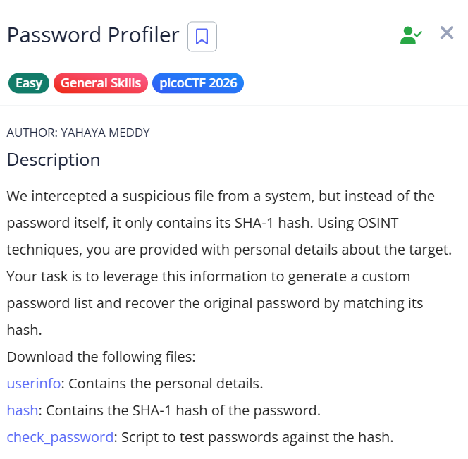
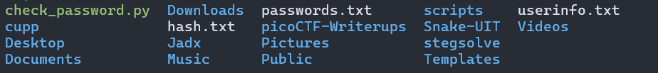
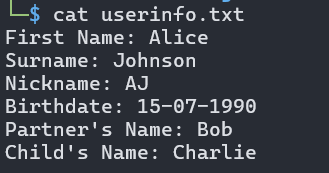
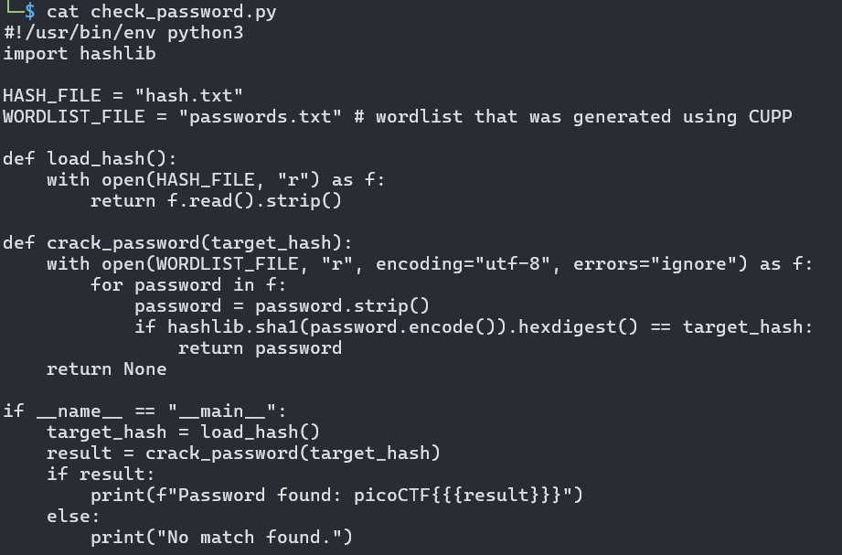
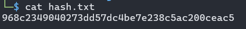
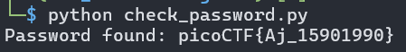

# picoCTF Writeup - Password Profiler

## Mục tiêu
Dưới đây là mô tả chi tiết từ đề bài:



Sử dụng các thông tin cá nhân thu thập được (OSINT) để tạo một danh sách mật khẩu tùy chỉnh (wordlist), sau đó tiến hành tấn công từ điển (dictionary attack) để bẻ khóa mã băm SHA-1 và lấy nội dung cờ (flag).

## Phân tích
Dựa trên các dữ kiện thu thập được:
- **Dấu hiệu:** Thử thách cung cấp 3 file: userinfo.txt (chứa thông tin cá nhân), hash.txt (chứa mã băm SHA-1 của mật khẩu: 968c2349040273dd57dc4be7e238c5ac200ceac5), và check_password.py (script Python dùng để so sánh chuỗi băm). Đặc biệt, thư mục làm việc và comment trong code có nhắc đến CUPP (Common User Passwords Profiler) - một công cụ chuyên tạo wordlist từ thông tin cá nhân.

- **Lỗ hổng:** Người dùng đặt mật khẩu yếu, dễ đoán, được hình thành từ việc ghép nối các thông tin cá nhân cơ bản (Tên, biệt danh, ngày sinh...).

- **Ý tưởng:** Đầu tiên, sử dụng công cụ CUPP kết hợp với các dữ kiện trong userinfo.txt (Alice, Johnson, AJ, 15-07-1990, Bob, Charlie) để sinh ra file passwords.txt. Sau đó, chạy script check_password.py để tự động băm mã SHA-1 từng dòng trong wordlist và đối chiếu với file hash.txt nhằm tìm ra mật khẩu gốc.

## Khai thác
Các bước thực hiện chi tiết:

1. **Kiểm tra thông tin cá nhân mục tiêu:**
Xem nội dung file userinfo.txt để lấy dữ liệu đầu vào:
```bash
cat userinfo.txt
# First Name: Alice
# Surname: Johnson
# Nickname: AJ
# Birthdate: 15-07-1990
# Partner's Name: Bob
# Child's Name: Charlie
```

2. **Tạo danh sách mật khẩu (Wordlist):**
Sử dụng công cụ cupp (đã có sẵn trong thư mục máy hoặc phải cài đặt) để tạo file passwords.txt bằng cách nhập các thông tin thu thập được ở bước 1 vào công cụ (bước này tạo ra file passwords.txt như thấy ở lệnh ls).

3. **Phân tích script kiểm tra mật khẩu:**
Xem nội dung file check_password.py để hiểu logic hoạt động:
```bash
cat check_password.py
```
Script này sẽ đọc mã băm từ hash.txt, sau đó lặp qua từng mật khẩu trong file passwords.txt, băm nó bằng thuật toán SHA-1 và so sánh. Nếu trùng khớp, nó sẽ in ra cấu trúc cờ chứa mật khẩu đó.

4. **Tiến hành bẻ khóa và lấy cờ:**
Chạy đoạn script bằng Python 3 để hệ thống tự động tìm kiếm mật khẩu đúng trong wordlist vừa tạo:
```bash
python check_password.py
```
Kết quả trả về / Flag thu được: picoCTF{Aj_15901990}

Các bước được mô tả bằng hình ảnh chi tiết:











