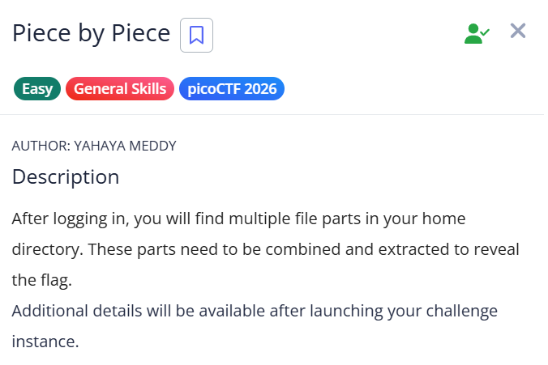
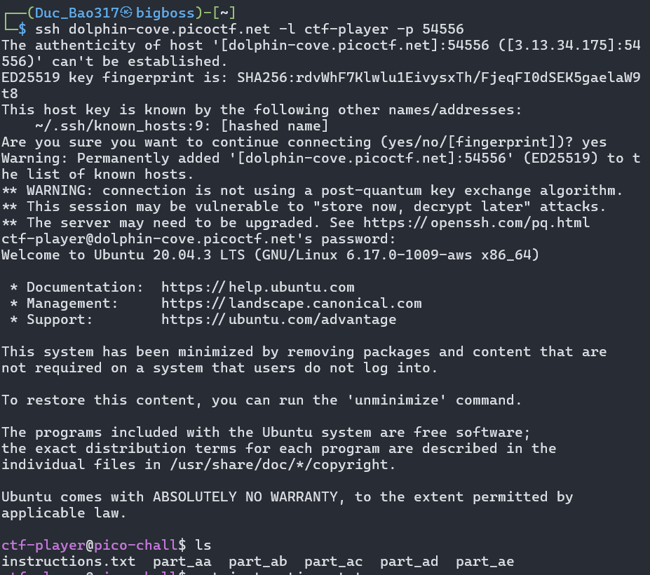
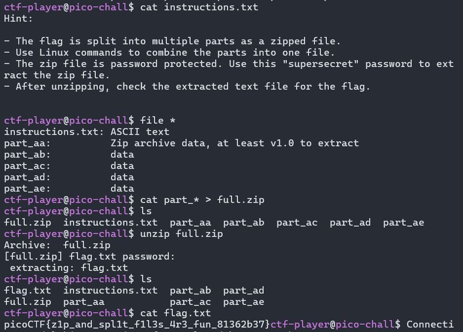

# picoCTF Writeup - Piece by Piece

## Mục tiêu
Dưới đây là mô tả chi tiết từ đề bài:



Đăng nhập vào máy chủ qua SSH, tìm cách gộp các mảnh của một file nén zip bị chia nhỏ lại với nhau, giải nén file đó bằng mật khẩu được cung cấp để lấy nội dung file flag.

## Phân tích
Dựa trên các dữ kiện thu thập được:
- **Dấu hiệu:** Đề bài và file `instructions.txt` trong thư mục chủ cho biết flag nằm trong một file nén zip, nhưng file này đã bị cắt thành nhiều mảnh nhỏ (từ `part_aa` đến `part_ae`). File nén này được bảo vệ bằng mật khẩu là `supersecret`.

- **Lỗ hổng:** Thử thách này thuộc danh mục General Skills nên không có lỗ hổng bảo mật. Trọng tâm của bài là kiểm tra kỹ năng thao tác với dòng lệnh Linux, cụ thể là cách nối file (concatenate) và giải nén (unzip) trong môi trường terminal.

- **Ý tưởng:** Chúng ta sẽ sử dụng lệnh `cat` với ký tự đại diện `*` để gộp toàn bộ các mảnh `part_aa`, `part_ab`... thành một file `.zip` hoàn chỉnh. Sau đó dùng lệnh `unzip` kết hợp mật khẩu được cho trước để trích xuất file chứa cờ.

## Khai thác
Các bước thực hiện chi tiết:

1. **Kết nối tới dịch vụ:**
Mở terminal và kết nối SSH vào máy chủ bằng lệnh sau (nhập mật khẩu được cấp trên giao diện web nếu được hỏi):
```bash
ssh dolphin-cove.picoctf.net -l ctf-player -p 54556
```


2. **Kiểm tra và đọc hướng dẫn:**
Sử dụng lệnh ls để liệt kê các file, ta thấy có file instructions.txt và các file từ part_aa đến part_ae. Đọc nội dung file hướng dẫn:
```bash
cat instructions.txt
```
Gợi ý lấy được: File zip đã bị chia nhỏ, cần gộp lại và dùng mật khẩu supersecret để giải nén.

3. **Gộp các mảnh file:**
Dùng lệnh cat để nối tất cả các file bắt đầu bằng chữ "part" và xuất kết quả ra một file mới tên là full.zip:
```bash
cat part_* > full.zip
```

4. **Giải nén và đọc Flag:**
Sử dụng lệnh unzip để giải nén file vừa tạo. Hệ thống sẽ yêu cầu mật khẩu, hãy nhập supersecret:
```bash
unzip full.zip
```
Sau khi giải nén thành công, file flag.txt sẽ xuất hiện. Đọc file này để lấy cờ:
```bash
cat flag.txt
```
Kết quả Flag thu được:
picoCTF{z1p_and_spl1t_f1l3s_4r3_fun_81362b37}

Các bước thực hiện còn lại:

